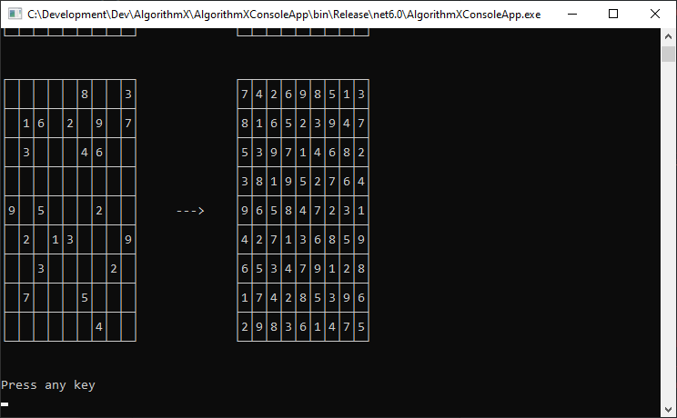
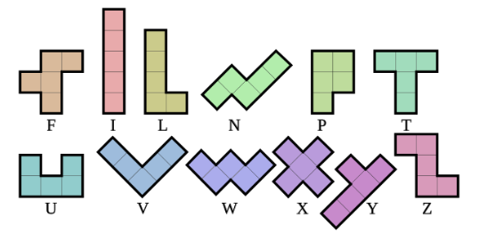
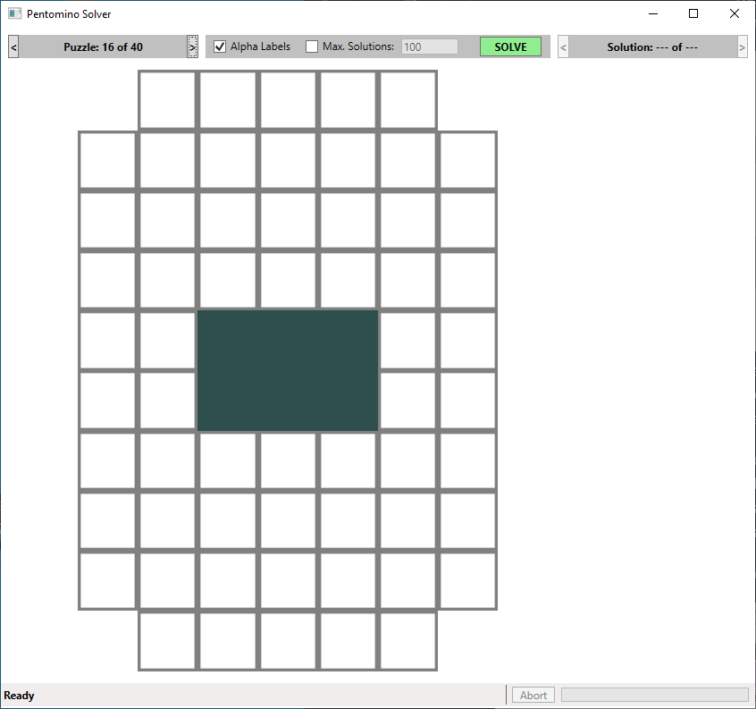
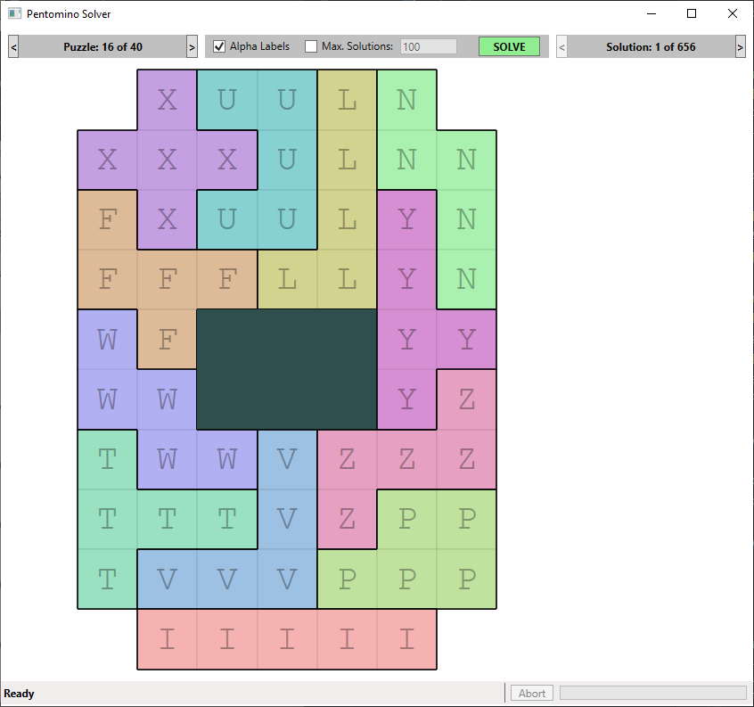

# Implementation of Donald Knuth's Algorithm X (for solving the Exact Cover problem), written in C# #

This repository contains the code for a C# implementation of Donald Knuth's Algorithm X (using 'dancing links') for solving the Exact Cover problem.  
Also included is a Windows console application that uses this functionality to solve Sudoku puzzles and a WPF application that uses the functionality to solve Pentomino tiling puzzles.

 

The AlgorithmX solution consists of the following projects:

- **AlgorithmXLib**: The code for a class library implementing the Algorithm X functionality.
- **AlgorithmXLib.Tests**: A handful of unit tests for the AlgorithmXLib library functionality.
- **AlgorithmXConsoleApp**: A Windows console application that uses the library to solve Sudoku puzzles.
- **Pentominoes**: A WPF application that uses the library to solve Pentomino tiling puzzles.

 

### Prerequisites

- [.NET 6 SDK](https://dotnet.microsoft.com/en-us/download/dotnet/6.0)

 

### What does it do?

Solves the exact cover problem - Given a collection S of subsets of a set X, an exact cover is a subcollection S* of S such that each element in X is contained in exactly one subset in S*. (see https://en.wikipedia.org/wiki/Exact_cover)  
Therefore, a solution to the exact cover must satisfy the following conditions:
1) The Intersection of any two subsets in S* must be empty.  
2) The Union of all subsets in S* is the set X.  
  
The exact cover problem is represented in Algorithm X by using a matrix consisting of 1s and 0s (or True and False). The aim is to find a subset of the rows such that the digit 1 (or True) appears in each column exactly once. (see https://en.wikipedia.org/wiki/Knuth%27s_Algorithm_X)

 
 

### The AlgorithmXConsoleApp console application

The console application uses the AlgorithmXLib class library to solve sudoku puzzles (there are 5 puzzles hard-coded into the application).  
On running the application, solutions to these hard-coded puzzles are output to the console window, as follows:

 
 

### The Pentominoes WPF application
The WPF application uses the AlgorithmXLib class library to solve Pentomino tiling puzzles.  
Pentominoes are polygons made up of 5 equal-sized squares connected edge-to-edge. A complete set of pentominoes consists of 12 such polygons, which are often labelled with the letter of the alphabet that the pentomino most resembles, as shown in the following image:  

The objective is to fill all squares on a puzzle board by positioning (i.e. tiling) the pentominoes (which can also be rotated and reflected as required).  
A pentomino can only be placed on a puzzle once; however, and not all pentominoes need to be used (for example, when the puzzle board is smaller and therefore has fewer than 60 vacant squares)    
The application has 40 in-built puzzles. Solutions can be found for 39 of these (there is no solution for the 40th puzzle)  
  
You can step through the puzzles using the '<' and '>' buttons located to the left and right of the puzzle number display. When the required puzzle has been selected, click the 'SOLVE' button to find solutions.  
It should be noted that some puzzles can have a *lot* of solutions!  If it is looking like there are going to be a large number of solutions, it is possible to abort the search by clicking the 'Abort' button in the status bar.  
It is also possible to limit the number of solutions that will be found by checking the 'Max. Solutions' checkbox and entering a value for the maximum number of solutions in the corresponding edit field (so, for example, if 100 has been entered, the search will end as soon as 100 solutions have been found)  
Finally, it is possible to label the pentomino pieces with their corresponding alphabetic label by checking the 'Alpha Labels' checkbox.  
  
When a puzzle has been selected (but has not yet been solved), the application display appears as follows:

 
 

When the puzzle has been solved, the application display looks like the following:  

 
You can step through the solutions using the '<' and '>' buttons located to the left and right of the solution number display.  
 
 

### Acknowledgements
- Donald Knuth - Solving the exact cover problem using Algorithm X and the 'dancing links' technique (see https://arxiv.org/pdf/cs/0011047.pdf)  
  

 
 

### History

| Version | Details
|---:| ---
| 1.0.0 | Initial implementation of the Algorithm X class library, Sudoku solver console application, and the Pentomino Solver WPF application.

